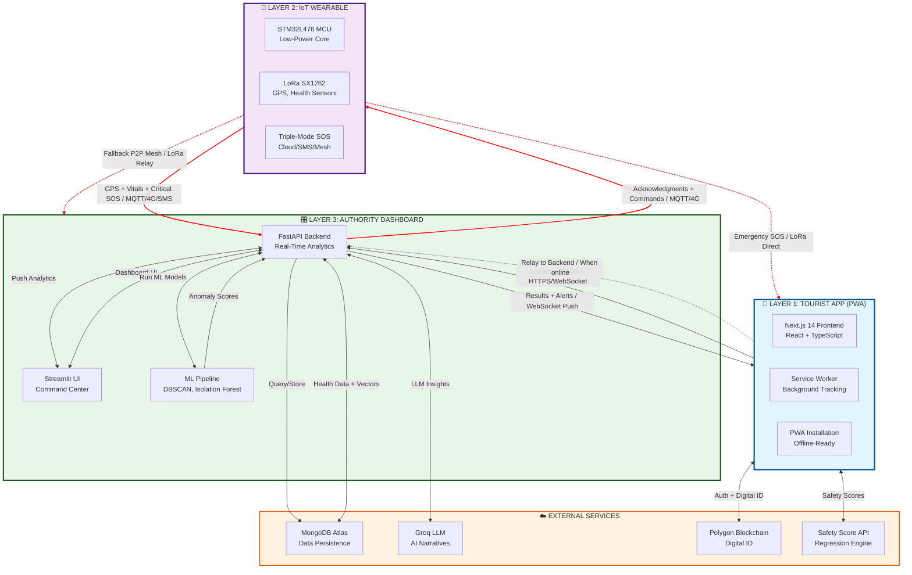
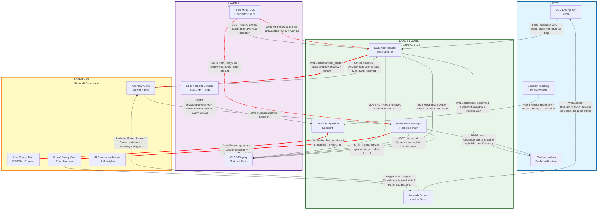
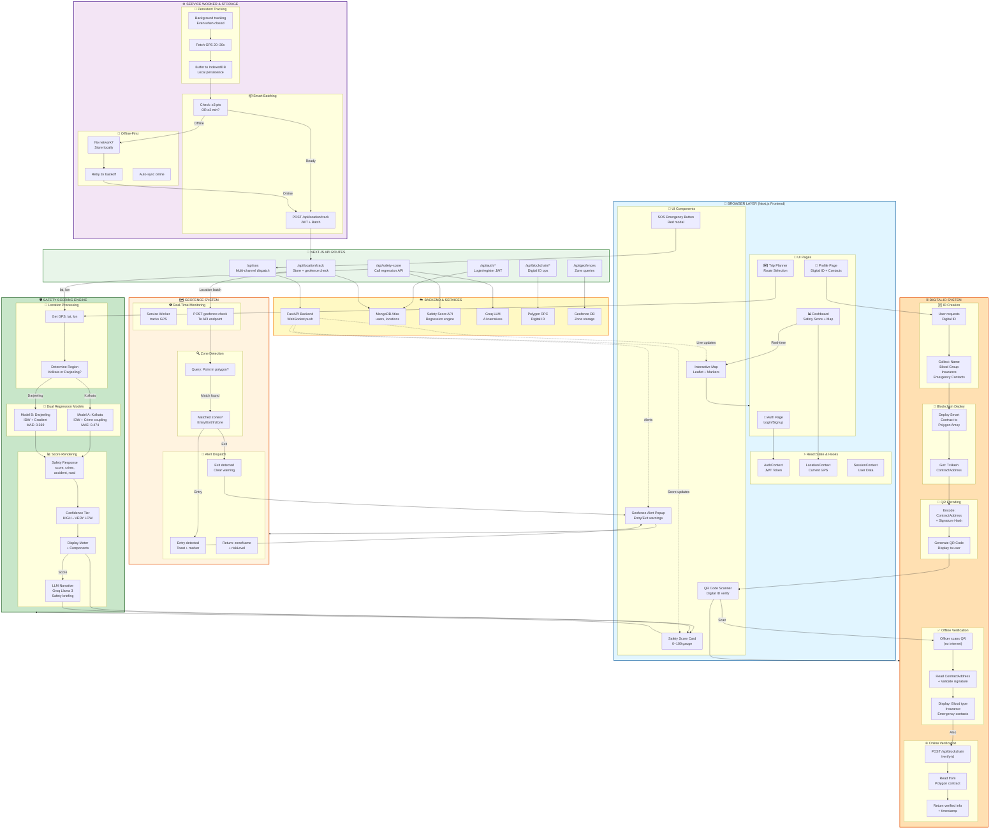
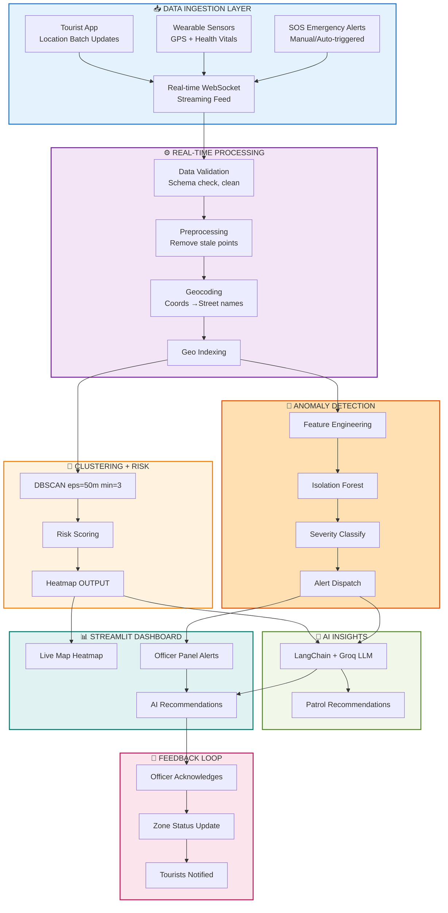
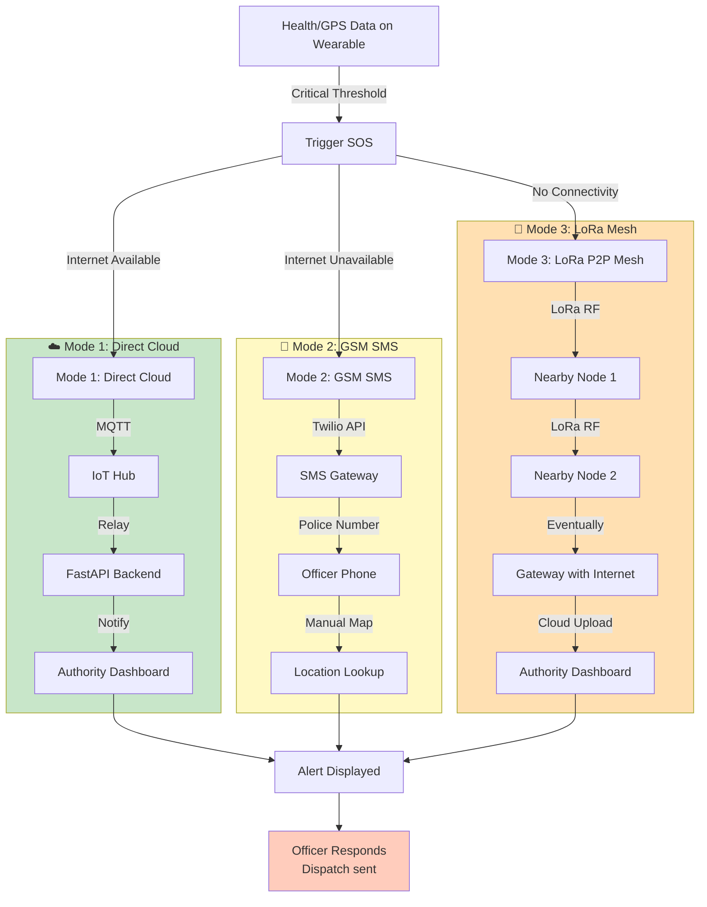
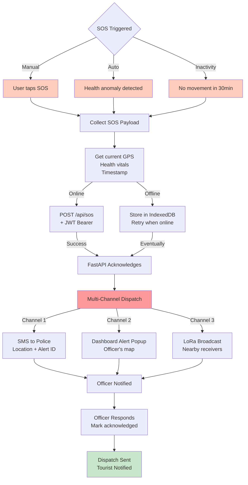
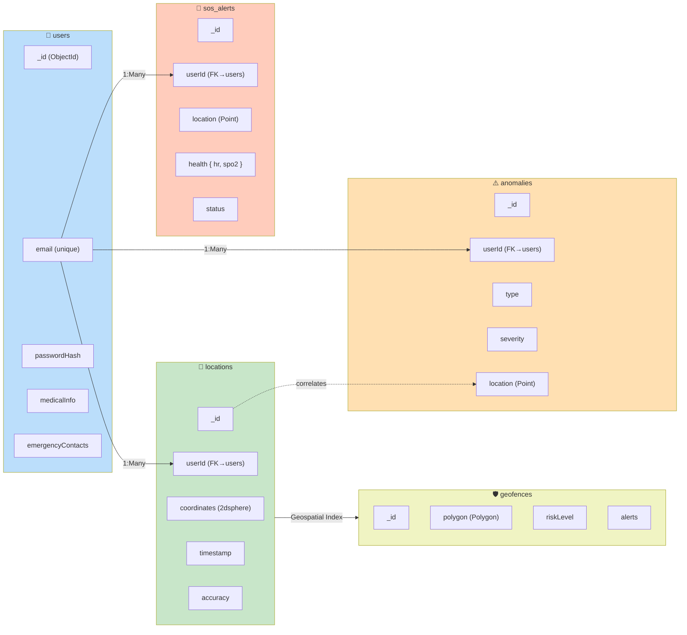
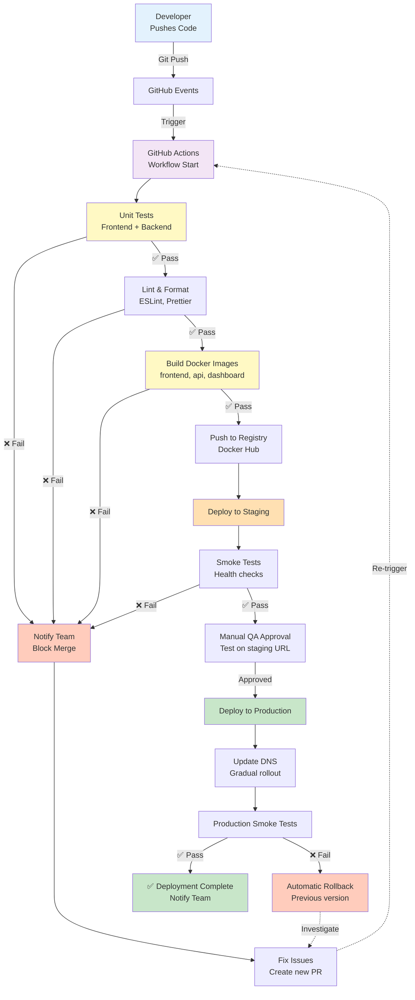
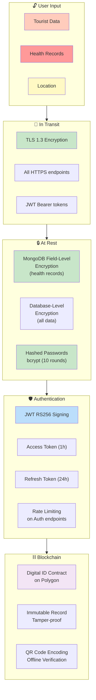
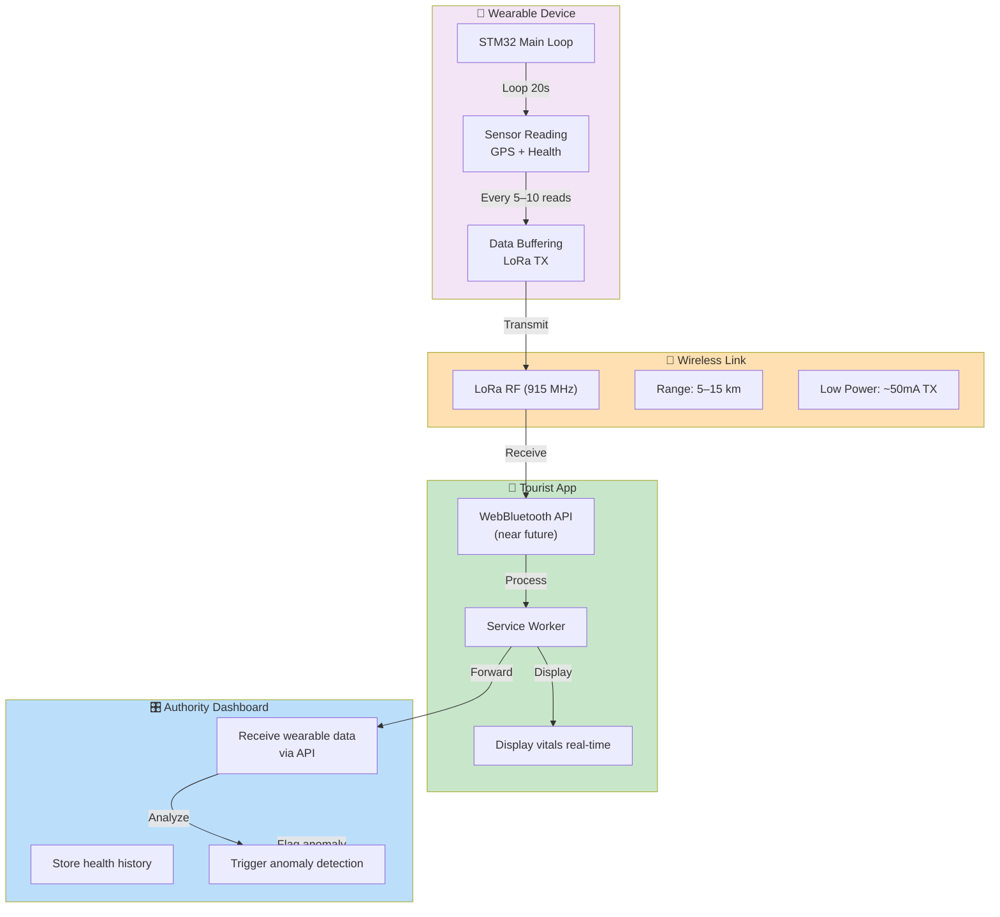

# 🏗️ SETUKA ARCHITECTURE DIAGRAMS

> Visual representations of Setuka's system architecture, data flows, and component interactions

---

## 1. HIGH-LEVEL SYSTEM ARCHITECTURE

### 3-Layer Ecosystem Overview (Complete Data Flow)

---

## 2. COMPLETE LAYER-TO-LAYER DATA FLOWS

### Wearable ↔ Backend ↔ Dashboard Communication Mesh

---

## 3. TOURIST APP: COMPLETE FEATURE STACK

### All Features Combined: Location Tracking + Safety Scoring + Geofencing + Digital ID

**Feature Flows:**

**🟢 LOCATION TRACKING (Persistent):**
- Foreground: Real-time display on map (20s intervals)
- Background: Service Worker continues, buffers with IndexedDB
- Offline: Stores locally, auto-syncs when online

**🛡️ SAFETY SCORING (Live Computation):**
- Fetch GPS coordinates
- Route through region detection (Kolkata Model A vs Darjeeling Model B)
- Dual regression engines compute score (0–100)
- Display meter + AI narrative from Groq LLM

**🗺️ GEOFENCING (Real-Time Alerts):**
- Location batch → Check geofence zones
- Detect entry/exit via polygon containment
- Instant popup alert to user (no refresh needed)
- Risk level displayed on map

**⛓️ DIGITAL ID (Offline-Accessible):**
- Deploy smart contract to Polygon Amoy
- QR encode with contract address + signature
- Officer scans offline → Reads medical info directly from QR
- Online verification checks blockchain state

---

## 4. AUTHORITY DASHBOARD: COMPLETE REAL-TIME ANALYTICS PIPELINE

### Consolidated: Data Ingestion + Clustering + Anomaly Detection + LLM Insights + Dashboard UI + Officer Feedback

---

## 5. IoT WEARABLE HARDWARE STACK

### Triple-Mode SOS Transmission

---

## 6. EMERGENCY SOS TRIGGERING PROTOCOL

### Multi-Channel Alert Dispatch

---

## 7. DATABASE SCHEMA RELATIONSHIPS

### MongoDB Collections & Indexing

---

## 8. CI/CD & DEPLOYMENT PIPELINE

### Automated Testing & Deploy Flow

---

## 9. SECURITY & ENCRYPTION ARCHITECTURE

### Data Protection Layers

---

## 10. WEARABLE ↔ APP COMMUNICATION PROTOCOL

### Real-Time Data Sync Between Devices

---

**Complete Diagram Index (10 Total):**

1. **High-Level System Architecture** — 3-layer ecosystem + external services + bidirectional data connections
2. **Complete Layer-to-Layer Data Flows** — Wearable ↔ backend ↔ dashboard communication mesh with all protocols
3. **Tourist App: Complete Feature Stack** — Browser UI pages + React context + Service Worker background tracking + Safety scoring (dual-region) + Geofencing (entry/exit alerts) + Blockchain Digital ID (offline-accessible QR) + all integrations
4. **Authority Dashboard: Complete Real-Time Analytics Pipeline** — Data ingestion (tourist app + wearables + SOS) → processing → DBSCAN clustering + risk scoring + heatmap → Isolation Forest anomalies + severity classification → LLM insights + recommendations → Streamlit UI + officer controls → feedback loop
5. **IoT Wearable Hardware** — Triple-mode SOS transmission (Cloud/SMS/LoRa mesh)
6. **Emergency SOS Protocol** — Multi-channel alert dispatch (SMS, dashboard, LoRa broadcast)
7. **Database Schema** — MongoDB collections, relationships, and geospatial indexing
8. **CI/CD Pipeline** — GitHub Actions workflow (tests → build → staging → production → monitoring)
9. **Security Architecture** — Encryption layers (transport, auth, storage, blockchain)
10. **Wearable ↔ App Communication** — LoRa/BLE data sync between wearable and app

---

> All diagrams are interactive Mermaid flowcharts. You can copy them into [Mermaid Live Editor](https://mermaid.live/) for visualization and editing.
>
> **Key Enhancements:** 
> - **Diagram #3:** Now consolidates 4 key features into ONE "Tourist App: Complete Feature Stack" showing:
>   - Browser UI pages (Auth, Dashboard, Trip Planner, Profile)
>   - React context & state management
>   - Foreground tracking (real-time, 20s) + Service Worker background tracking (continues when closed)
>   - Smart batching (≥3 points OR 2 min threshold) + offline-first IndexedDB buffer + 3x retry backoff
>   - Safety scoring (Kolkata Model A: IDW+crime coupling vs Darjeeling Model B: IDW+gradient) with LLM narratives
>   - Geofencing (real-time zone detection, entry/exit alerts, polygon containment)
>   - Digital ID (blockchain deployment on Polygon Amoy, QR encoding, offline verification)
>   - All UI components (interactive map, safety meter, SOS button, geofence alerts, QR scanner, vitals)
>   - Next.js API routes with JWT auth + backend service integration
> 
> - **Diagram #4:** Now consolidates Authority Dashboard pipeline (previously 3 separate diagrams) into "Complete Real-Time Analytics Pipeline":
>   - Data ingestion: Tourist app locations + wearable sensors (GPS/health vitals) + SOS emergencies via WebSocket
>   - Processing layer: Validation → preprocessing → geocoding → geospatial indexing
>   - Clustering: DBSCAN (eps=50m, min_samples=3) → crowd detection → risk scoring (using crime data + road quality + patrol density) → heatmap (GREEN < 30, YELLOW 30-50, ORANGE 50-75, RED > 75)
>   - Anomaly detection: Feature engineering → Isolation Forest model → severity classification (Normal/Minor/Medium/Critical) → alert dispatch to officer panel
>   - AI insights: LangChain agent chain + Groq LLM (Llama 3, <50ms response) → patrol recommendations + resource allocation
>   - Dashboard UI: Streamlit interface with Folium map layer + officer alert panel + AI suggestions + control actions
>   - Feedback loop: Officer acknowledgement → zone status update → tourist notification via WebSocket
> 
> - **Benefits:**
>   - Diagram #3: Eliminates 3 redundant diagrams by merging safety, blockchain, and geofencing into single comprehensive feature view
>   - Diagram #4: Eliminates 2 redundant diagrams by integrating DBSCAN clustering and Isolation Forest anomalies into unified pipeline
>   - Overall: Reduces documentation from 16 → 10 diagrams while maintaining complete system visibility
> 
> - **Additional Note:** Diagram #2 shows complete bidirectional communication between wearable and dashboard including primary MQTT/4G, SMS fallback, LoRa P2P relay, and WebSocket real-time updates
