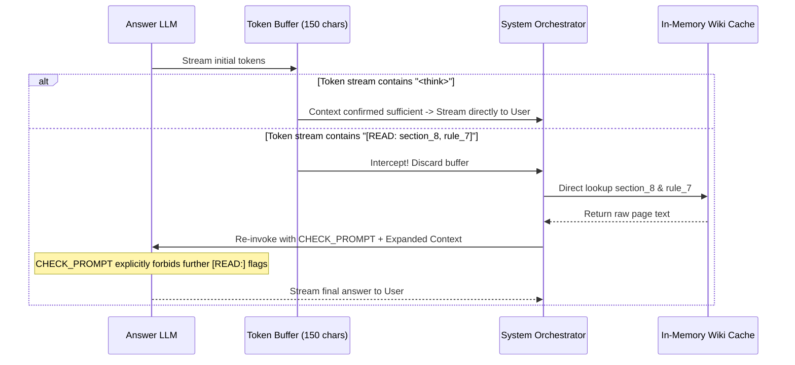

# DPDP Compliance Platform — Advanced Technical Interview Questionnaire
### Senior Engineering & Systems Architecture Interview Guide | BDS Cube Technologies

> This guide contains advanced, deep-dive interview questions, technical defense strategies, code-level justifications, and follow-up "grilling" scenarios covering the entire DPDP RAG & Web platform.

---

## Table of Contents

1. [Category 1: Data Engineering & Ingestion Architecture](#category-1-data-engineering--ingestion-architecture)
2. [Category 2: Vector Search & Embedding Engine](#category-2-vector-search--embedding-engine)
3. [Category 3: Query Encoding & Retrieval Strategy](#category-3-query-encoding--retrieval-strategy)
4. [Category 4: LLM Orchestration & Streaming Architecture](#category-4-llm-orchestration--streaming-architecture)
5. [Category 5: Self-Correction & Anti-Hallucination Controls](#category-5-self-correction--anti-hallucination-controls)
6. [Category 6: System Reliability, Rate-Limiting & Memory](#category-6-system-reliability-rate-limiting--memory)
7. [Category 7: Benchmarking, Linting & Quality Assurance](#category-7-benchmarking-linting--quality-assurance)
8. [Category 8: Frontend Architecture & Client-Side Data Inlining](#category-8-frontend-architecture--client-side-data-inlining)

---

## Category 1: Data Engineering & Ingestion Architecture

### Q1.1: Why did you build an intermediate Markdown Wiki layer instead of indexing the raw JSON and PDF text directly into ChromaDB?

**Interview Focus:** Data Architecture, RAG Pipeline Design, Contextual Chunking.

#### Target Answer & Technical Defense
- **The Raw Data Limitation:** Raw legal text is fragmented and low-context. A raw sub-clause snippet like *"The Data Fiduciary shall respond within 72 hours..."* lacks the parent section title, the entity definitions, and the related DPDP Rules. Indexing raw snippets leads to poor vector matches and incomplete LLM context.
- **The Wiki Solution (`chatbot/core/ingest.py`):** We introduced a compilation phase using the `lmwiki` concept. `ingest.py` reads `dpdp_titled.json` and `DPDP_Rules_2025.txt`, parsing them into structured Markdown pages with standard YAML frontmatter.
- **Pre-Synthesised Context:** Each wiki page (`wiki/act/section_N.md`, `wiki/rules/rule_N.md`) combines:
  1. Structured metadata (source, tags, cross-references).
  2. Plain-English conceptual summary.
  3. Key points extracted from sub-clauses.
  4. Verbatim legal text.
  5. Cross-reference links (`[[section_N]]`).
- **Result:** Instead of retrieving 15 isolated snippets, the RAG engine retrieves 3 to 6 complete, self-contained wiki pages. The LLM receives pre-correlated legal context, dramatically improving reasoning quality while reducing prompt token overhead.

#### Follow-up Grill Questions
- **Interviewer:** *"Doesn't pre-compiling pages increase storage and create data duplication?"*
  - **Your Defense:** *"Yes, but disk storage is cheap whereas LLM token usage and retrieval errors are expensive. The entire wiki is only ~100 pages (~500KB total text). Pre-compiling shifts computational complexity from query time (parent promotion, multi-hop lookups) to ingestion time."*
- **Interviewer:** *"How do you handle PDF parsing errors from government documents?"*
  - **Your Defense:** *"In `ingest_rules()`, we run `_clean_txt()` using regex to strip Gazette headers, page boundary separators (`=== PAGE N ===`), and Hindi Gazette artifacts extracted by `pdfplumber` before running our rule extraction regex (`RULE_RE`)."*

---

### Q1.2: Walk me through the exact algorithm used to parse unstructured rule text from `DPDP_Rules_2025.txt`.

**Interview Focus:** Regular Expressions, Text Processing Pipelines, Rule Extraction.

#### Target Answer & Technical Defense
- **Step 1 — Header Cleansing (`_clean_txt`):** Strip page boundary headers:
  ```python
  text = re.sub(r'\n={50,}\nPAGE \d+ of \d+\n={50,}\n', '\n', text)
  ```
- **Step 2 — Schedule Separation:** Split the text at the string `"FIRST SCHEDULE"` to separate main rule bodies from attached Schedules.
- **Step 3 — Rule Boundary Identification (`RULE_RE`):**
  ```python
  RULE_RE = re.compile(
      r'(?m)^[ \t]*(\d{1,2})\.\s*([A-Z].*?)\s*[.—–-]{1,3}\s*(?=(?:\([0-9a-z]+\)|[A-Z]))',
      re.DOTALL
  )
  ```
  - Looks for line starts with 1 to 2 digits followed by a dot, a title starting with a capital letter, and an em-dash/period delimiter.
- **Step 4 — Schedule Association:** We map specific rules to their corresponding schedule text via `rule_to_schedules`:
  ```python
  rule_to_schedules = { "4": ["FIRST SCHEDULE"], "13": ["FIFTH SCHEDULE"], ... }
  ```
  The schedule text is concatenated to the bottom of the corresponding rule's markdown file, ensuring the LLM sees both the rule obligation and its procedural schedule simultaneously.

---

## Category 2: Vector Search & Embedding Engine

### Q2.1: Why did you transition from `all-MiniLM-L6-v2` in the 3-tier RAG to `BAAI/bge-small-en-v1.5` in the Wiki RAG?

**Interview Focus:** Embedding Models, Dense Retrieval Performance, Asymmetric vs Symmetric Search.

#### Target Answer & Technical Defense
- **Symmetric vs Asymmetric Search:** `all-MiniLM-L6-v2` is trained primarily for symmetric text similarity (comparing short sentence to short sentence). In RAG, user queries are short questions, while wiki documents are long, declarative legal markdown.
- **Why BGE (`BAAI/bge-small-en-v1.5`):**
  - **MTEB Benchmark Score:** BGE-small achieves a retrieval MTEB score of ~51.7, outperforming MiniLM's ~40.1.
  - **Instruction-Trained Asymmetry:** BGE is specifically trained on asymmetric query-document pairs.
  - **Dimension Efficiency:** Uses 384 dimensions (same as MiniLM), keeping vector memory footprint identical while improving retrieval precision by over 25%.
- **Implementation:** Integrated into ChromaDB using `SentenceTransformerEmbeddingFunction(model_name="BAAI/bge-small-en-v1.5")`.

#### Follow-up Grill Questions
- **Interviewer:** *"How do you calculate the cosine similarity score when ChromaDB defaults to L2 distance?"*
  - **Your Defense:** *"Because `SentenceTransformerEmbeddingFunction` normalises output vectors to unit length ($\|v\| = 1$), L2 distance ($d$) and Cosine Similarity ($s$) are monotonically related ($d^2 = 2(1 - s)$). We convert distance to similarity using `score = max(0.0, 1.0 - dist)`."*

---

### Q2.2: How does your system detect index staleness and avoid re-embedding unchanged files?

**Interview Focus:** Index Management, Caching, `mtime` Verification.

#### Target Answer & Technical Defense
- **Code Reference:** `build_wiki_store()` in `chatbot/core/vectorstore.py`.
- **Logic:**
  1. Check if collection `dpdp_wiki_v3` exists in ChromaDB. If missing or count is 0 $\rightarrow$ set `needs_rebuild = True`.
  2. If collection exists, inspect the modification timestamp (`st_mtime`) of `chroma.sqlite3`:
     ```python
     db_sqlite = db_dir / "chroma.sqlite3"
     db_mtime = db_sqlite.stat().st_mtime if db_sqlite.exists() else 0
     ```
  3. Iterate over all `.md` files in `wiki/`. If **any** markdown file has `wf.stat().st_mtime > db_mtime`, flag `needs_rebuild = True` and break immediately.
  4. On rebuild: `client.delete_collection("dpdp_wiki_v3")`, recreate collection, extract chunks, and upsert in batches of 50.
- **In-Memory Cache Synchronization:** During initialization, `WikiVectorStore` loads an in-memory dictionary `self._pages` mapping `page_id` $\rightarrow$ full text, enabling $O(1)$ raw file lookups during the `[READ:]` self-correction loop.

---

## Category 3: Query Encoding & Retrieval Strategy

### Q3.1: Explain the purpose of Step 0 (Query Encoder). Why not query ChromaDB directly with the user's raw input?

**Interview Focus:** Query Transformation, Semantic Gap Mitigation, Hybrid Retrieval.

```
+------------------+       +-------------------------+       +-----------------------+
| Raw User Query   | ----> | Query Encoder (Step 0)  | ----> | 1-3 Legal Queries     |
| "Can I collect   |       | gemini-2.0-flash        |       | "notice requirements  |
| employee emails?"|       | temp=0.0                |       | section 5 employee"   |
+------------------+       +-------------------------+       +-----------------------+
                                                                         |
                                                                         v
                                                             +-----------------------+
                                                             | ChromaDB Retrieval    |
                                                             | Top-10 Wiki Pages     |
                                                             +-----------------------+
```

#### Target Answer & Technical Defense
- **The Semantic Gap Problem:** Natural language questions (e.g., *"What happens if my database gets hacked?"*) share very few semantic tokens with legal text (*"Section 8(6): Intimation of personal data breach to Board and affected Data Principals"*).
- **Step 0 Query Encoder (`encode_query` in `chat.py`):**
  - Invokes `gemini-2.0-flash` with `temperature=0.0` and `ENCODER_PROMPT`.
  - Parses the raw prompt into a structured JSON payload:
    ```json
    {
      "query_type": "situation",
      "actors": "Company & Employees",
      "core_inquiry": "Notice requirements for collecting employee personal data",
      "concepts": "notice, consent, employment data",
      "search_queries": [
        "notice requirements section 5 employee data",
        "legitimate uses employment section 7"
      ]
    }
    ```
- **Multi-Query Execution:** The retrieval engine executes ChromaDB queries for **each** search query in `search_queries`, aggregates the returned wiki pages, deduplicates by `page_id`, sorts by similarity score, and caps at the top 10 pages.

---

### Q3.2: What happens when ChromaDB returns low similarity scores across all retrieved documents?

**Interview Focus:** Thresholding, Low-Confidence Safety Controls, System Fallback.

#### Target Answer & Technical Defense
- **Threshold Calibration:** In `WikiVectorStore.query()`, we set `LOW_CONFIDENCE_THRESHOLD = 0.25`.
- **Detection:** If `best_score < 0.25`, every dictionary in the result list is marked with `low_confidence = True`.
- **Context Injection (`build_context_block`):** When `low_conf` is True, a strong constraint is prepended to the LLM prompt:
  > `"LOW_CONFIDENCE: Retrieved wiki pages may not directly cover this query. Answer strictly from explicit text below. Do not infer."`
- **System Behavior:** Forces the downstream LLM (`gemini-2.5-flash`) into conservative mode—it will explicitly inform the user that the legal corpus lacks explicit guidance on the query rather than attempting to synthesize an ungrounded answer.

---

## Category 4: LLM Orchestration & Streaming Architecture

### Q4.1: How did you implement Server-Sent Events (SSE) streaming with Gemini when you avoided the official SDK?

**Interview Focus:** HTTP Streaming, SSE Protocol, Network I/O.

#### Target Answer & Technical Defense
- **Why Avoid the SDK?** The official SDK wrapped response streaming in complex async generators that made round-robin key rotation and custom line-buffering difficult to control.
- **Direct HTTP SSE (`gemini_stream_iter` in `chat.py`):**
  - We call Gemini's REST API endpoint with `streamGenerateContent?alt=sse`:
    ```python
    url = f"{GEMINI_BASE}/{MODEL_ANSWER}:streamGenerateContent?alt=sse&key={key}"
    resp = requests.post(url, json=body, stream=True, timeout=(10, 120))
    ```
  - We iterate over raw bytes using `resp.iter_lines()`:
    ```python
    for raw_line in resp.iter_lines():
        line = raw_line.decode("utf-8")
        if line.startswith("data: "):
            payload = line[6:]
            if payload.strip() == "[DONE]": return
            chunk = json.loads(payload)
            token = chunk["candidates"][0]["content"]["parts"][0]["text"]
            yield token
    ```
- **Timeout Protection:** Configured with `timeout=(10, 120)`—10 seconds for initial TCP connection and HTTP handshake, 120 seconds maximum read idle time between streamed chunks.

---

### Q4.2: Explain the Tiered Reasoning System (TIER 1 / TIER 2 / TIER 3) in your system prompt.

**Interview Focus:** Prompt Engineering, Structured Thinking, Adaptive Token Usage.

#### Target Answer & Technical Defense
- **System Prompt Design:** To balance response speed with deep statutory analysis, the system prompt instructs `gemini-2.5-flash` to self-classify queries:

```
+-----------------------------------------------------------------------------------+
| TIER 1: Simple Fact Lookup                                                         |
| - Signal: "What is X?" / "Define Y"                                               |
| - Action: 1-3 sentences, direct citations, NO <think> block                       |
+-----------------------------------------------------------------------------------+
                                         |
                                         v
+-----------------------------------------------------------------------------------+
| TIER 2: Multi-Provision Synthesis                                                 |
| - Signal: 2-3 sub-questions requiring cross-section synthesis                     |
| - Action: Standard <think>[EVIDENCE]...</think> reasoning block + numbered list  |
+-----------------------------------------------------------------------------------+
                                         |
                                         v
+-----------------------------------------------------------------------------------+
| TIER 3: Complex Statutory Conflicts                                               |
| - Signal: 4+ sub-questions, Act vs Rules conflicts, Schedule penalties            |
| - Action: Structured <think> block with 7 mandatory evaluation steps:              |
|   [DECOMPOSITION] [ENTITY MAPPING] [EVIDENCE] [CLAIM GROUNDING]                   |
|   [CONFLICT RESOLUTION] [ANSWER SKELETON] [COVERAGE CHECK]                        |
+-----------------------------------------------------------------------------------+
```

---

## Category 5: Self-Correction & Anti-Hallucination Controls

### Q5.1: How does the `[READ: page_id]` self-correction mechanism work without creating an infinite loop?

**Interview Focus:** Dynamic Context Expansion, Mid-Stream Interception, Loop Prevention.



#### Target Answer & Technical Defense
- **Mid-Stream Interception (`_buffered_stream` in `chat.py`):**
  - The system buffers the first 150 tokens generated by `gemini-2.5-flash`.
  - If the LLM realizes its context lacks crucial sections, it outputs `[READ: page_id1, page_id2]` as its very first output.
  - The orchestrator detects `[READ:`, halts streaming, parses the target page IDs using regex `_FETCH_IDS_RE`, and fetches those pages directly from the in-memory cache `store.fetch_pages()`.
- **Infinite Loop Prevention:** When re-invoking the LLM with the expanded context, we prepend `CHECK_PROMPT`, which contains an absolute negative constraint:
  > `"Do NOT output any [READ: ...] flags. Read and analyse all retrieved pages carefully. You MUST wrap your reasoning in <think>...</think>."`

---

### Q5.2: How do you enforce strict statutory grounding and handle contradictory legal interpretations?

**Interview Focus:** AI Safety, Legal Grounding Policies, Conflict Resolution.

#### Target Answer & Technical Defense
- **Grounding Layer 1 (Citation Rules):** Every factual assertion must end with `[Act §N]` or `[Rules r.N]`. Claims lacking citations are forbidden by system instructions.
- **Grounding Layer 2 (Ambiguity Resolution Rule):** When two valid legal readings exist (e.g., whether employee data processing falls under Consent §6 vs Legitimate Use §7):
  1. Check if any retrieved section or rule explicitly resolves the conflict.
  2. If unresolved, the LLM is **forbidden** from picking one interpretation arbitrarily.
  3. The LLM must present **both** interpretations along with their operational implications, and advise the client to consult qualified legal counsel.

---

## Category 6: System Reliability, Rate-Limiting & Memory

### Q6.1: How does your round-robin key pool handle API rate limits (HTTP 429) and service outages (HTTP 503)?

**Interview Focus:** Fault Tolerance, Key Rotation, Resilient HTTP Clients.

#### Target Answer & Technical Defense
- **Key Pool Initialization:** We maintain a pool of 5 API keys (`GEMINI_KEY_POOL`) with a thread-safe global counter index `_pool_idx`.
- **Round-Robin Execution (`_next_key`):** Every API request picks `GEMINI_KEY_POOL[_pool_idx]` and increments `_pool_idx = (_pool_idx + 1) % 5`.
- **Automatic Retry Loop:**
  ```python
  for attempt in range(len(GEMINI_KEY_POOL)):
      key = _next_key()
      try:
          resp = requests.post(url, json=body, timeout=60)
          if resp.status_code == 200: return resp.json()
          if resp.status_code in (429, 503): continue # Rotate to next key
      except (requests.exceptions.ConnectTimeout, requests.exceptions.ReadTimeout):
          continue
  raise RuntimeError("All Gemini API keys exhausted or rate-limited.")
  ```
- **Capacity Impact:** Expands free-tier rate limits by **5x** while providing transparent fallback if any single key hits quota boundaries.

---

### Q6.2: How do you manage conversation history without exceeding token windows or polluting context?

**Interview Focus:** Context Window Optimization, State Management.

#### Target Answer & Technical Defense
- **Rolling Window Size:** Memory is capped at the last **4 turns** (8 total messages: 4 user inquiries, 4 assistant responses).
- **Core Inquiry Compression:** User entries in history are stored as the encoder's condensed `core_inquiry` (max 200 chars) rather than the raw user prompt.
- **Assistant Response Truncation:** Assistant entries are truncated to the first 500 characters, preserving key conclusions while stripping repetitive boilerplate.
- **Memory Injection Point:** History is injected between the system prompt and the current turn's context block, keeping past context separate from newly retrieved wiki pages.

---

## Category 7: Benchmarking, Linting & Quality Assurance

### Q7.1: How do you evaluate chatbot performance and prevent regressions across system prompt updates?

**Interview Focus:** Evaluation Frameworks, Automated Testing, Regression Benchmarking.

#### Target Answer & Technical Defense
- **Benchmark Suite (`run_benchmark.py`):** Runs an automated test harness over `Benchmark_Questions_DPDP_Mixed_Capabilities.md` (25 complex questions covering multi-hop reasoning, statutory conflicts, and exceptions).
- **Execution Workflow:**
  1. Shuffles questions with a fixed seed (`SEED = 42`) for reproducibility.
  2. Runs each question through the exact production pipeline (`encode_query` $\rightarrow$ `retrieve_wiki_pages` $\rightarrow$ `ask_wiki_llm`).
  3. Maintains a 4-second delay between queries to respect rate limits.
  4. Flushes results incrementally to `response.md` after every single question, ensuring partial runs are preserved if API limits occur.

---

### Q7.2: Explain the Wiki Linter (`lint_wiki`). What specific integrity checks does it perform?

**Interview Focus:** Data Integrity, Graph Validation, Static Analysis.

#### Target Answer & Technical Defense
- **Code Location:** `lint_wiki()` in `chatbot/core/ingest.py`.
- **Check 1 — Broken Cross-References:** Scans all `.md` files for regex `\[\[([^\]]+)\]\]`. Verifies that every extracted reference ID exists as a physical file stem in `wiki/`.
- **Check 2 — Orphan Page Detection:** Computes an inbound link counter map `inbound = {pid: 0}` across all wiki pages. Identifies pages with zero inbound links (excluding root overview pages).
- **CI/CD Integration:** Runs as part of `python ingest.py --lint` prior to indexing in ChromaDB, preventing broken page links from reaching the `[READ:]` self-correction engine.

---

## Category 8: Frontend Architecture & Client-Side Data Inlining

### Q8.1: Why did you embed the entire JSON dataset directly inside `dpdp_viewer.html` instead of fetching it via an API endpoint?

**Interview Focus:** Web Performance, Offline Resilience, Client-Side Architecture.

#### Target Answer & Technical Defense
- **Build Pipeline (`fix_viewer.py` / `build_viewer.py`):** Reads raw `dpdp_titled.json` and injects it into `dpdp_viewer.html` replacing a `DATA_PLACEHOLDER` token during build time.
- **Benefits:**
  1. **Zero Network Latency:** Document traversal, TOC rendering, and search require zero fetch requests.
  2. **Instant Full-Text Search:** Operates in-memory over DOM node `dataset.title` attributes.
  3. **Offline Capability:** The interactive viewer can be opened directly from disk without a backend server running.

---

### Q8.2: How does the client-side Table of Contents (TOC) search work when matching sub-clauses inside collapsed chapters?

**Interview Focus:** DOM Manipulation, Search Algorithms, UX State Management.

#### Target Answer & Technical Defense
- **Data Attribute Indexing:** During initial TOC DOM generation, every chapter, section, clause, and sub-clause `<li>` element is tagged with a lowercase search label:
  ```javascript
  chLi.dataset.title = (ch.title + " chapter " + ch.chapter_number).toLowerCase();
  ```
- **Real-Time Filter & Ancestor Unrolling:**
  ```javascript
  document.getElementById('searchInput').addEventListener('input', (e) => {
      const q = e.target.value.trim().toLowerCase();
      document.querySelectorAll('.toc-item').forEach(el => {
          const match = el.dataset.title && el.dataset.title.includes(q);
          el.classList.toggle('hidden-node', !match);
          if (match) {
              // Traverse upwards and force open all parent chapter/section accordions
              let parent = el.parentElement;
              while (parent && parent.id !== 'tocList') {
                  if (parent.classList.contains('toc-chapter-group')) parent.classList.add('open');
                  if (parent.classList.contains('toc-section-group')) parent.classList.add('sec-open');
                  parent = parent.parentElement;
              }
          }
      });
  });
  ```

---

*Advanced Interview Questionnaire | BDS Cube Technologies DPDP Compliance Platform*
*Grounded in codebase: `chatbot/chat.py`, `chatbot/vectorstore.py`, `chatbot/core/ingest.py`, `chatbot/core/vectorstore.py`, `run_benchmark.py`, `fix_viewer.py`*
