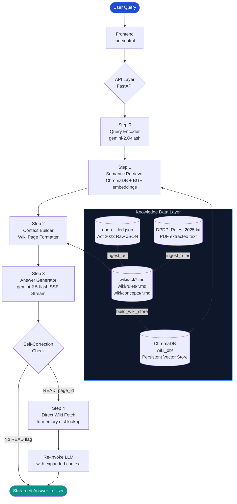
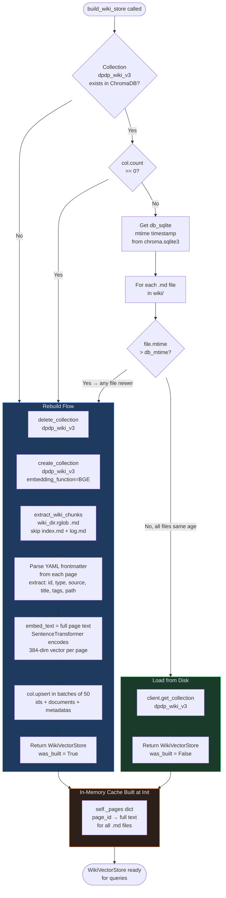
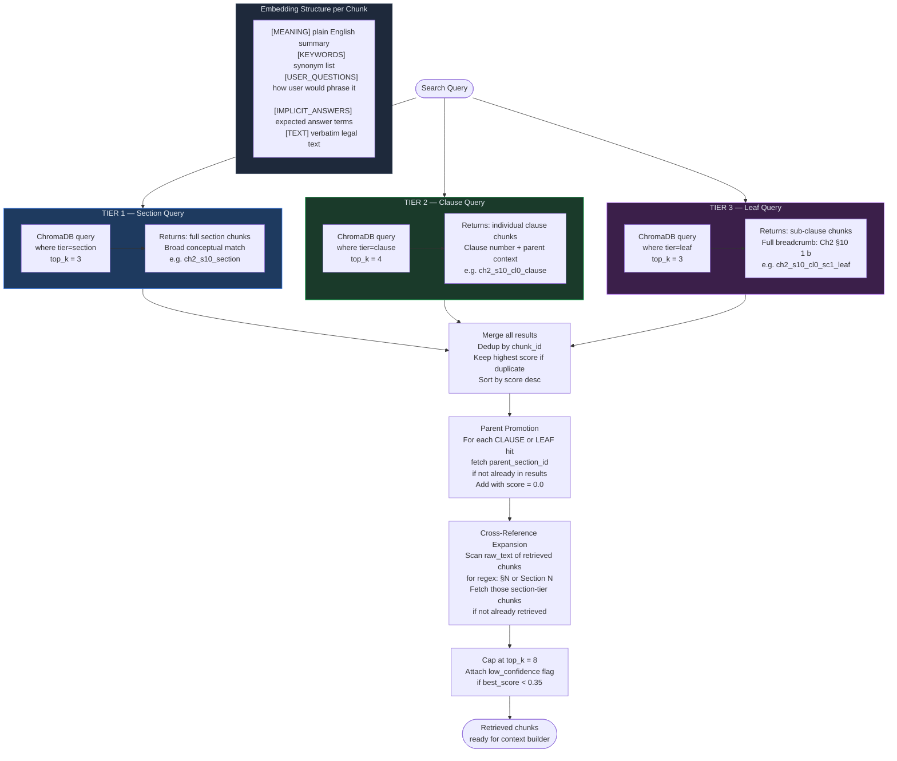
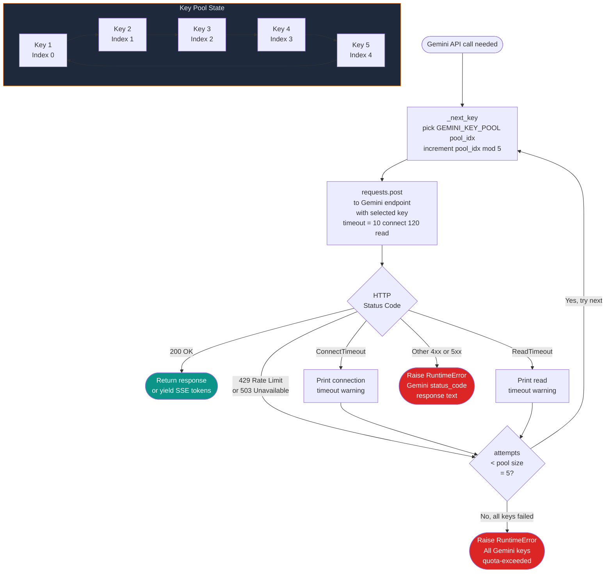
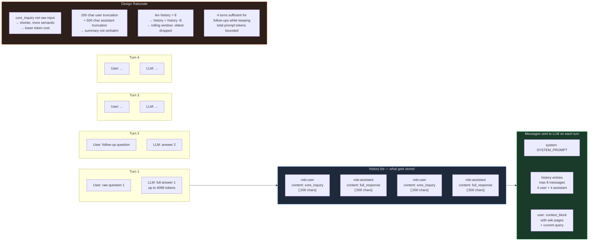
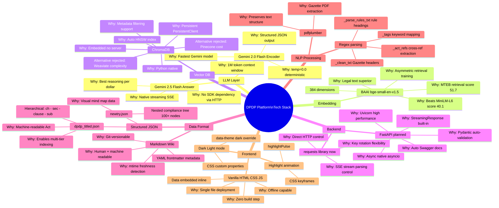
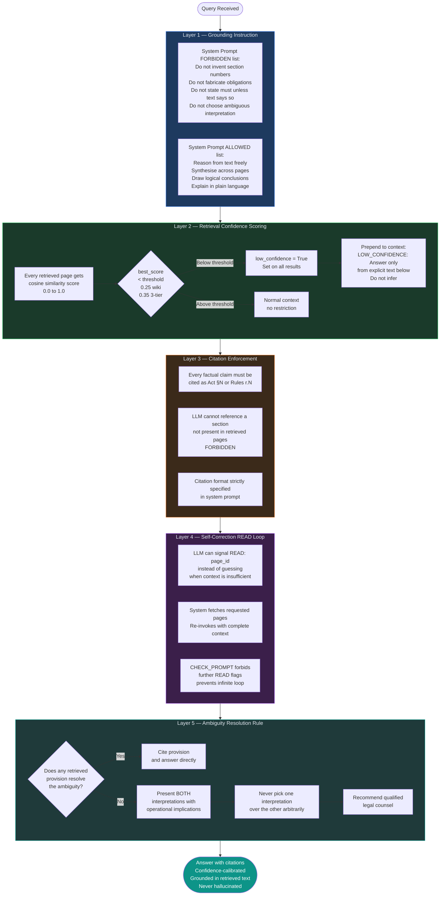
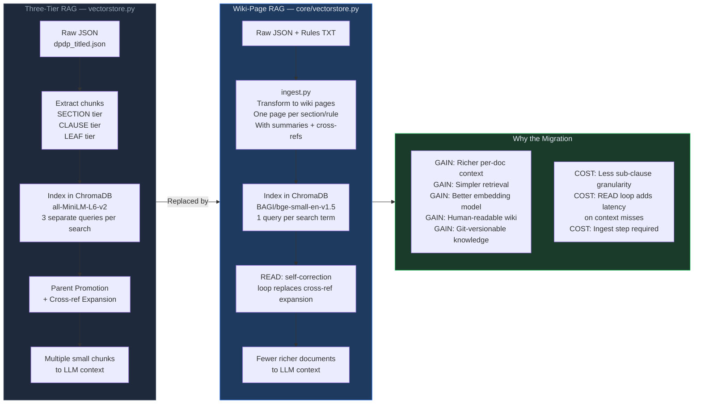
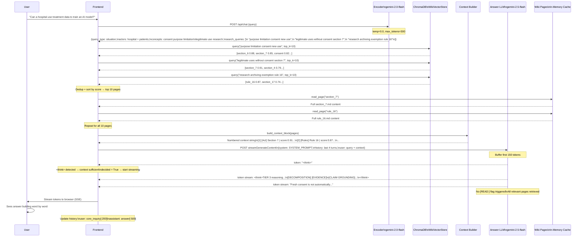

# DPDP Compliance Platform — Technical Flowcharts
## RAG System & Chatbot: Techniques, Methods, Processes & Tech Stack

---

## 1. Master System Flow (Top Level)



---

## 2. Knowledge Ingestion Pipeline

> **Purpose:** Transform raw, immutable legal PDFs/JSON into a structured, annotated wiki of Markdown pages that power retrieval.

```mermaid
flowchart TD
    subgraph RAW [Raw Sources — Never Modified]
        R1[(dpdp_titled.json\nDPDP Act 2023\nHierarchical JSON)]
        R2[(DPDP_Rules_2025.txt\nExtracted from PDF\nvia pdfplumber)]
    end

    subgraph INGEST_ACT [ingest_act — Act Ingestion]
        A1[Load JSON\nparse chapters list]
        A2[For each chapter\niterate sections]
        A3[_flatten obj\nrecursively join\nclauses + sub_clauses\n+ sub_sub_clauses]
        A4[_tags raw_text\nkeyword to tag\nmapping dict]
        A5[_act_refs raw_text\nregex: section|§ N\nextract cross-refs]
        A6[Build key_points\nfrom clause list\nclause.content 20+ chars]
        A7[Write\nwiki/act/section_N.md\nYAML frontmatter\n+ Summary + Key Points\n+ Verbatim + Cross-Refs]
        A1 --> A2 --> A3
        A3 --> A4
        A3 --> A5
        A3 --> A6
        A4 & A5 & A6 --> A7
    end

    subgraph INGEST_RULES [ingest_rules — Rules Ingestion]
        B1[Read raw TXT]
        B2[_clean_txt\nRemove Gazette headers\nRemove page separators\nCollapse blank lines]
        B3[Split on FIRST SCHEDULE\nmain_rules_text vs schedules_text]
        B4[RULE_RE regex\nMatch N. TITLE — pattern\nextract rule number + title + body]
        B5[rule_to_schedules dict\nAppend schedule content\nto matched rules]
        B6[_rule_key_points\nextract sub-rule\n1 2 3... items]
        B7[Write\nwiki/rules/rule_N.md]
        B1 --> B2 --> B3 --> B4 --> B5 --> B6 --> B7
    end

    subgraph INGEST_CONCEPTS [ingest_concepts — Synthesis Pages]
        C1[6 hardcoded concept bodies:\nconsent, data_fiduciary,\ndata_principal_rights,\npenalties, children_data,\ndata_transfer]
        C2[Combine act_refs + rules_refs\nfrom multiple sections + rules]
        C3[Write wiki/concepts/*.md\nCross-cutting synthesis\npre-answering common queries]
        C1 --> C2 --> C3
    end

    subgraph INDEX [update_index + write_overview]
        D1[Build wiki/index.md\nFull catalog: ID + path\n+ title + summary + tags]
        D2[Build wiki/overview.md\nAct structure table\nRules structure table\nAct-Rules mapping table]
    end

    R1 --> INGEST_ACT
    R2 --> INGEST_RULES
    INGEST_ACT & INGEST_RULES & INGEST_CONCEPTS --> INDEX

    style RAW fill:#1e293b,stroke:#475569,color:#e2e8f0
    style INGEST_ACT fill:#1e3a5f,stroke:#3b82f6,color:#e2e8f0
    style INGEST_RULES fill:#1a3a2a,stroke:#22c55e,color:#e2e8f0
    style INGEST_CONCEPTS fill:#3b1f4a,stroke:#a855f7,color:#e2e8f0
    style INDEX fill:#2d1f1a,stroke:#f97316,color:#e2e8f0
```

---

## 3. Vector Store Build & Freshness Detection

> **Problem Solved:** The index must always reflect the current wiki state. If a wiki page changes, the embeddings must be regenerated — but not unnecessarily.



---

## 4. RAG Query Pipeline — Full Detail

> **Core Architecture:** Wiki-Page RAG (current production system)
> The 5-step pipeline that runs on every user query.

```mermaid
flowchart TD
    USER([User Question\ne.g. Does my startup need a DPO?]) --> S0

    subgraph S0 [STEP 0 — Query Encoding]
        E1[Build messages list\nsystem=ENCODER_PROMPT\nuser=raw_question]
        E2[gemini_complete\nmodel: gemini-2.0-flash\ntemp: 0.0  max_tokens: 300]
        E3[Parse JSON response\nstrip markdown fences\njson.loads]
        E4{Parse\nsucceeded?}
        E5[Return structured dict:\nquery_type, actors\ncore_inquiry, concepts\nsearch_queries list]
        E6[Fallback: use raw input\nas single search query]
        E1 --> E2 --> E3 --> E4
        E4 -- Yes --> E5
        E4 -- No / Exception --> E6
    end

    S0 --> S1

    subgraph S1 [STEP 1 — Semantic Retrieval]
        R1[For each search_query\nin search_queries list]
        R2[WikiVectorStore.query\ntop_k=10 per query]
        R3[ChromaDB cosine similarity\nBAAI/bge-small-en-v1.5\n384-dim vectors]
        R4[score = max 0.0  1.0 - L2_distance]
        R5[Deduplicate by page_id\nkeep highest score\nif same page appears\nfrom multiple queries]
        R6[Sort by score desc\ncap at 10 pages total]
        R7{best_score\n< 0.25?}
        R8[Set low_confidence = True\nfor all results]
        R9[Results with metadata:\npage_id, source_doc, title\nscore, tags, path]
        R1 --> R2 --> R3 --> R4 --> R5 --> R6 --> R7
        R7 -- Yes --> R8 --> R9
        R7 -- No --> R9
    end

    S1 --> S2

    subgraph S2 [STEP 2 — Context Construction]
        C1{low_confidence\nflagged?}
        C2[Prepend LOW_CONFIDENCE\nwarning string to context]
        C3[For each retrieved page\nNumbered 1 to N]
        C4[Read full page text\nstore.read_page page_id\nin-memory dict lookup]
        C5[Build header:\nN  source_label  title\npath  score  tags]
        C6[Concatenate:\nheader + full_page_text]
        C7[Join all pages\nwith --- separator]
        C8[Insert into user message:\nUSER QUERY + query metadata\n+ WIKI PAGES context block]
        C1 -- Yes --> C2 --> C3
        C1 -- No --> C3
        C3 --> C4 --> C5 --> C6 --> C7 --> C8
    end

    S2 --> S3

    subgraph S3 [STEP 3 — LLM Answer Generation]
        G1[Build messages list:\nsystem=SYSTEM_PROMPT\n+ rolling history 4 turns\n+ user=context_user_message]
        G2[POST to Gemini API\nstreamGenerateContent\nalt=sse  model=gemini-2.5-flash]
        G3[Token-by-token SSE parsing:\nfor line in resp.iter_lines\ndecode UTF-8\nparse data: JSON chunk\nextract text token]
        G4[Buffer first 150 tokens\nbefore yielding to user]
        G1 --> G2 --> G3 --> G4
    end

    S3 --> S4

    subgraph S4 [STEP 4 — Self-Correction Check]
        SC1{What appears\nin buffer?}
        SC2[think tag detected\nContext sufficient\nTIER 2 or 3 reasoning\nStart streaming]
        SC3[READ: page_ids\nContext insufficient\nLLM requests more pages]
        SC4[Buffer >= 150 chars\nNo flag detected\nContext sufficient\nStart streaming]
        SC5[Parse page_ids from\nREAD: x y z]
        SC6[store.fetch_pages\npage_ids not already\nin retrieved set\nDirect dict lookup]
        SC7[Re-invoke LLM\nWith pages + extra pages\n+ CHECK_PROMPT prefix\nDo not output READ flags]
        SC1 -- think --> SC2
        SC1 -- READ: --> SC3
        SC1 -- neither at 150 chars --> SC4
        SC3 --> SC5 --> SC6 --> SC7
    end

    SC2 & SC4 & SC7 --> OUT([Streamed Answer\nToken by Token\nCited  [Act N]  [Rules r.N]])

    style S0 fill:#1e3a5f,stroke:#3b82f6,color:#e2e8f0
    style S1 fill:#1a3a2a,stroke:#22c55e,color:#e2e8f0
    style S2 fill:#3b2a1a,stroke:#f97316,color:#e2e8f0
    style S3 fill:#3b1f4a,stroke:#a855f7,color:#e2e8f0
    style S4 fill:#1f3a3a,stroke:#14b8a6,color:#e2e8f0
```

---

## 5. Three-Tier RAG (Older Architecture) — Retrieval Detail

> The earlier implementation. Understand this because interviewers will ask about the architectural evolution.



---

## 6. LLM Tiered Reasoning System

> How the LLM self-classifies and adapts its reasoning depth to the complexity of the question.

```mermaid
flowchart TD
    Q([User Query arrives\nwith retrieved wiki pages]) --> LLM[LLM reads:\n1. System Prompt\n2. Conversation history\n3. Retrieved pages\n4. User question]

    LLM --> CLASS{Self-classify\nquery tier}

    CLASS --> T1 & T2 & T3

    subgraph T1 [TIER 1 — Simple]
        T1A["Signal: 'What is X?'\n'Who is a Y?'\n'What must Z do in case of W?'"]
        T1B[No think block\nAnswer in 1-3 sentences\nWith citations Act N]
        T1C[Example:\n'What is a Data Principal?'\n→ 'A Data Principal is any individual\nto whom personal data relates [Act §2]'"]
        T1A --> T1B --> T1C
    end

    subgraph T2 [TIER 2 — Multi-provision]
        T2A[Signal: 2-4 sub-questions\nRequires synthesis\nacross multiple pages]
        T2B["MUST use XML tags:\n<think> [EVIDENCE]... </think>"]
        T2C[After think block:\nNumbered list with citations]
        T2D[Example:\n'Does a bank need DPO?'\n→ Combines: §10 SDF definition\n+ r.13 SDF obligations\n+ §2 definitions']
        T2A --> T2B --> T2C --> T2D
    end

    subgraph T3 [TIER 3 — Complex]
        T3A[Signal: 4+ sub-questions\nSchedules + Rules + Act\nGenuine legal conflicts]
        T3B["MUST use structured think:\n[DECOMPOSITION]\n[ENTITY MAPPING]\n[EVIDENCE]\n[CLAIM GROUNDING]\n[CONFLICT RESOLUTION]\n[ANSWER SKELETON]\n[COVERAGE CHECK]"]
        T3C[Full markdown answer\nEvery sub-question numbered\nAmbiguity Rule applied]
        T3D[Example:\n'SDF + children's data breach\n→ notification timelines\n+ responsible personnel\n+ max penalties'"]
        T3A --> T3B --> T3C --> T3D
    end

    T1 & T2 & T3 --> POLICY

    subgraph POLICY [Cross-Cutting Policies Applied to All Tiers]
        P1[Cite every claim\n[Act §N clause]\n[Rules r.N sub-rule]]
        P2[Forbidden: Invent section numbers\nFabricate obligations\nChoose ambiguous interpretation]
        P3[Ambiguity Rule:\nPresent BOTH interpretations\nNever pick one\nRecommend legal counsel]
        P4[Framing: Regulatory analysis\nNOT legal advice]
    end

    style T1 fill:#1a3a2a,stroke:#22c55e,color:#e2e8f0
    style T2 fill:#1e3a5f,stroke:#3b82f6,color:#e2e8f0
    style T3 fill:#3b1f4a,stroke:#a855f7,color:#e2e8f0
    style POLICY fill:#2d1f1a,stroke:#f97316,color:#e2e8f0
```

---

## 7. API Key Pool — Quota Resilience Flow



---

## 8. Self-Correction [READ:] Loop — Detailed Flow

```mermaid
flowchart TD
    START([LLM starts generating\nfirst tokens]) --> BUF[Buffer incoming\ntokens\nbuffer = '']

    BUF --> TOK[Receive next token\nbuffer += token]

    TOK --> C1{think in\nbuffer?}
    C1 -- Yes --> STREAM[decided = True\nYield buffer\nthen stream all\nremaining tokens directly]

    C1 -- No --> C2{READ in\nbuffer?}

    C2 -- Yes --> BRACKET{Has closing\nbracket ]?}
    BRACKET -- Not yet and\nbuffer < 300 chars --> TOK

    BRACKET -- Yes --> PARSE[FETCH_RE regex\nextract page_id list\nfrom READ: x y z]

    PARSE --> FILTER[Filter: remove page_ids\nalready in retrieved set\nusing set of page_ids]

    FILTER --> FETCH[store.fetch_pages\npages_ids_to_fetch\nIn-memory dict lookup\nO 1 per page]

    FETCH --> RE_INVOKE[Build new messages\noriginal pages + extra pages\n+ CHECK_PROMPT\nDo NOT output READ flags\nMUST use think tags\nCite provisions]

    RE_INVOKE --> RE_STREAM[gemini_stream_iter\nwith expanded context\nStream final answer]

    RE_STREAM --> DONE([Answer streamed\nUser sees seamless\ncomplete response])

    C2 -- No --> C3{buffer >=\n150 chars\nFLAG_LIMIT?}
    C3 -- Yes --> STREAM
    C3 -- No --> TOK

    subgraph NOTE [What CHECK_PROMPT Does]
        N1[1. Do NOT output READ flags\n   prevents infinite loop]
        N2[2. MUST use think tags\n   forces structured reasoning]
        N3[3. Cite provisions\n   maintains anti-hallucination]
    end

    STREAM --> DONE

    style START fill:#1d4ed8,color:#fff
    style DONE fill:#0d9488,color:#fff
    style NOTE fill:#1e293b,stroke:#a855f7,color:#e2e8f0
```

---

## 9. Conversation Memory Management



---

## 10. Complete Tech Stack — Choice Justification



---

## 11. Anti-Hallucination Architecture



---

## 12. Architectural Evolution: 3-Tier → Wiki-Page RAG



---

## 13. End-to-End Sequence: Real Query Trace

> Concrete example: *"Can a hospital use treatment data to train an AI model?"*



---

## Quick Reference: Technique Map

| Technique | Where Used | Why This Technique |
|-----------|-----------|-------------------|
| **RAG (Retrieval-Augmented Generation)** | Main chatbot pipeline | Grounds LLM to actual legal text; prevents hallucination of provisions |
| **Semantic Embedding** | ChromaDB + BGE | Bridges the gap between user language and legal language |
| **Asymmetric Retrieval** | BAAI/bge-small-en-v1.5 | Query is short+question-form; documents are long+declarative. BGE trained for this |
| **YAML Frontmatter** | Wiki pages | Machine-readable metadata (source, tags, cross-refs) embedded in human-readable files |
| **Keyword-to-Tag Mapping** | `_tags()` in ingest.py | Enables metadata filtering in vector DB; classifies sections by compliance domain |
| **Regex Cross-Ref Extraction** | `_act_refs()`, `_rule_refs()` | Detects `§N` / `Section N` / `rule N` patterns to build the knowledge graph |
| **Three-Tier Indexing** | vectorstore.py (older) | Solves granularity mismatch: Section for context, Clause for specificity, Leaf for precision |
| **Parent Promotion** | vectorstore.py | Ensures sub-clause matches always include full section context |
| **Wiki-Page Indexing** | core/vectorstore.py | Pre-compiled pages are context-complete; one rich document beats multiple small chunks |
| **mtime Freshness Detection** | build_wiki_store() | Auto-detects stale index without needing a manual manifest |
| **Token Buffering** | _buffered_stream() | Detects `<think>` vs `[READ:]` in first 150 tokens before passing through |
| **SSE Streaming** | gemini_stream_iter() | Token-by-token delivery — responsive UX, no wait for full response |
| **Round-Robin Key Pool** | _next_key() | ~5x free-tier quota; automatic 429 failover |
| **Rolling History Window** | chat_loop() | 4-turn (8-message) context; uses `core_inquiry` (not raw input) for efficiency |
| **Tiered LLM Reasoning** | SYSTEM_PROMPT TIER 1/2/3 | Matches answer depth to question complexity; avoids over-reasoning simple queries |
| **Ambiguity Resolution Rule** | SYSTEM_PROMPT | Prevents arbitrary legal interpretation; presents both readings when text is genuinely unclear |
| **Self-Correction Loop** | ask_wiki_llm() | LLM signals context gaps; system fetches + re-invokes transparently |
| **Benchmark Framework** | run_benchmark.py | Measures system quality on 25 mixed-capability legal questions; saves after every Q |
| **Wiki Linter** | lint_wiki() | Detects broken cross-refs and orphan pages; maintains knowledge base integrity |
| **PDF Preprocessing** | _clean_txt() | Removes Gazette headers, page separators, Hindi text artifacts from pdfplumber output |
| **Data-Inline HTML** | fix_viewer.py | Embeds JSON into HTML at build time; zero-server, offline-capable viewer |

---

*Flowchart document for BDS Cube Technologies DPDP Compliance Platform*
*Sources: `chatbot/chat.py` | `chatbot/core/vectorstore.py` | `chatbot/core/ingest.py` | `chatbot/vectorstore.py` | `run_benchmark.py` | `fix_viewer.py`*
