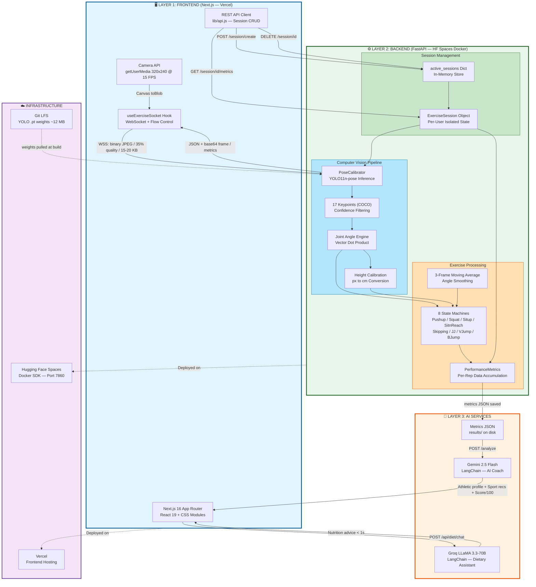
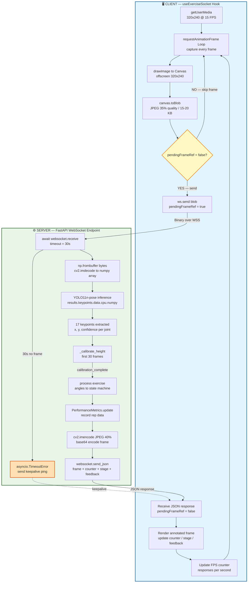
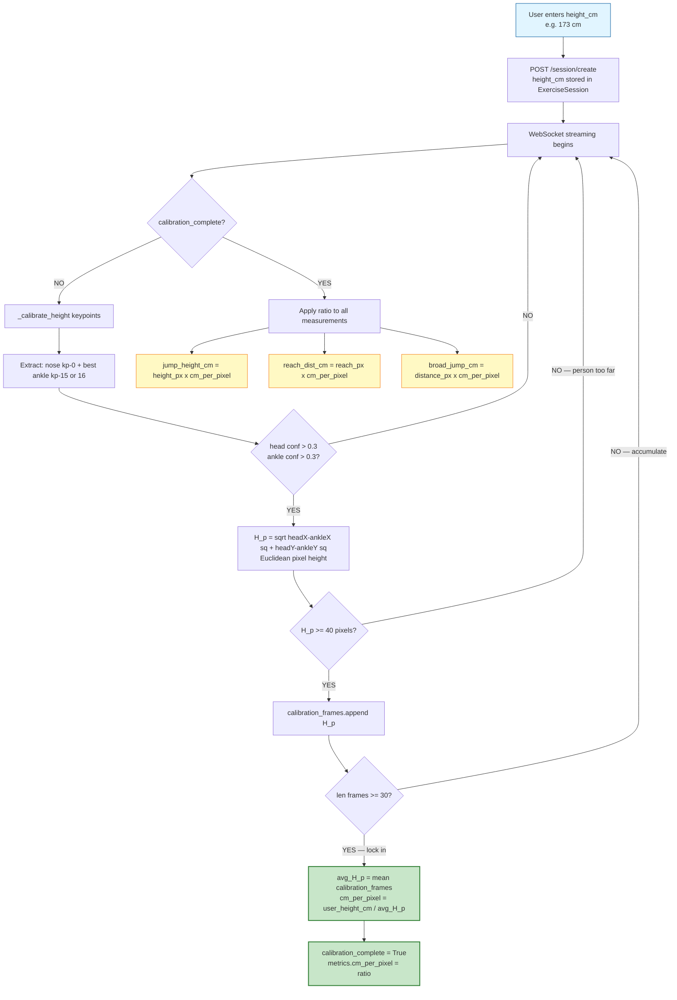
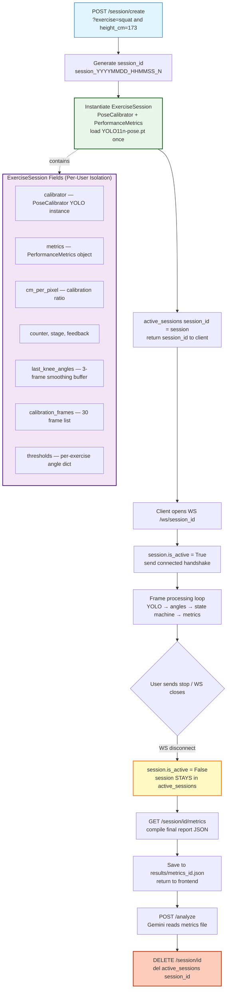
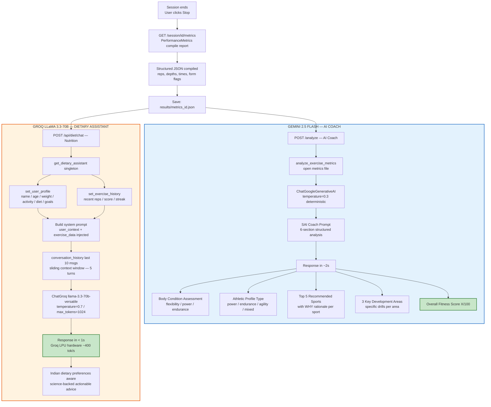
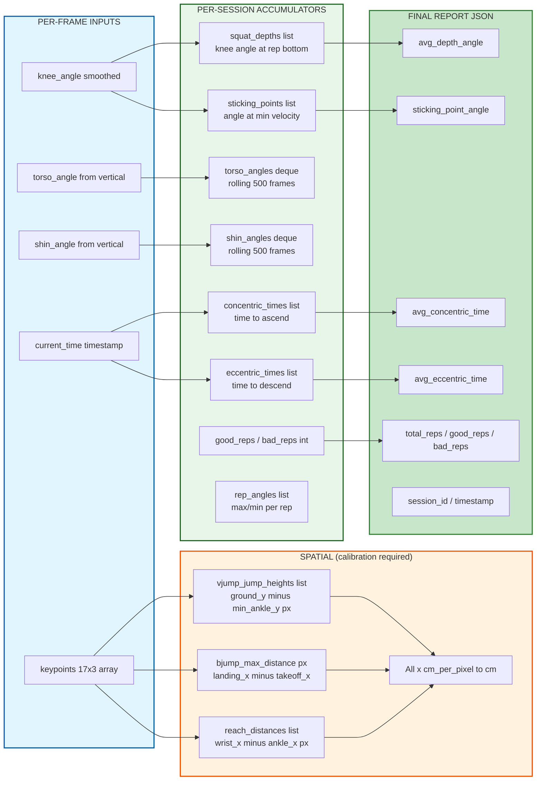
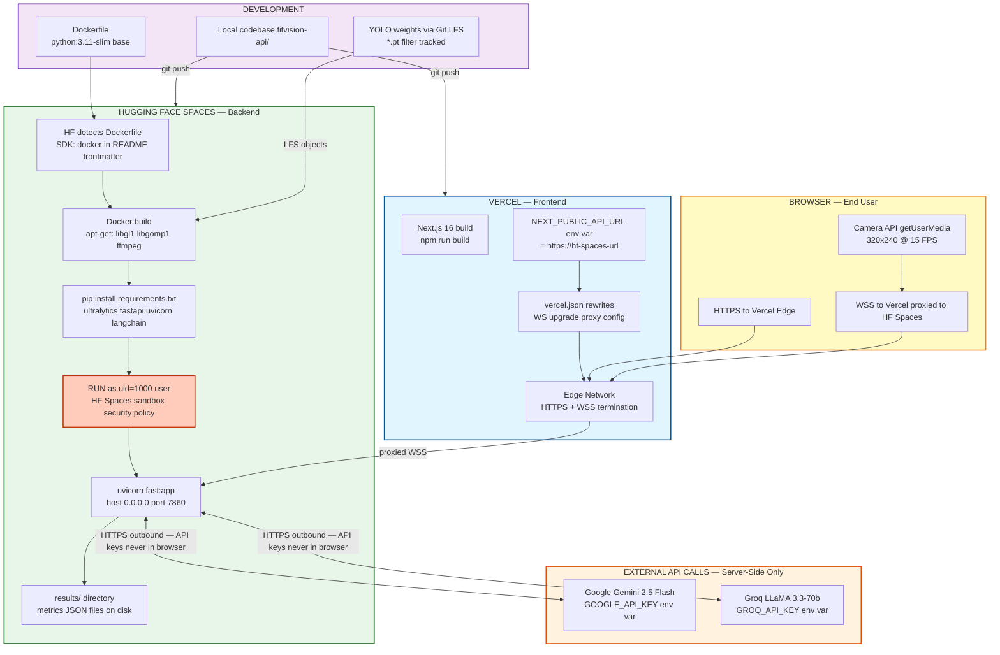
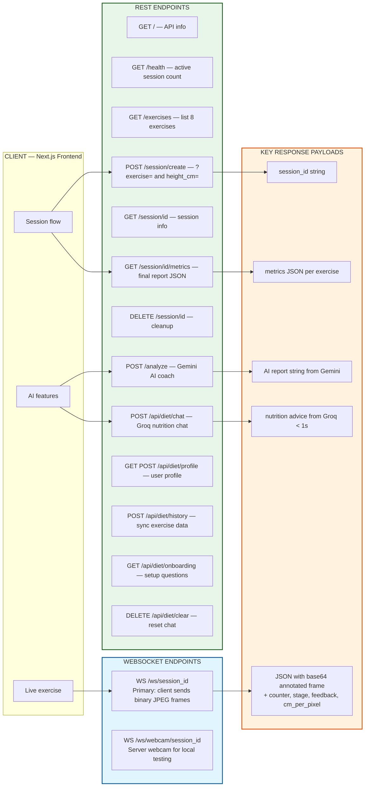

# 🏋️ FITVISION — ARCHITECTURE DIAGRAMS

> Visual representations of FitVision's system architecture, real-time pipeline, exercise state machines, AI integrations, and deployment topology.
> Smart India Hackathon 2025 Finalist | FastAPI · YOLO11n-Pose · OpenCV · Next.js · Gemini · Groq

---

## 1. HIGH-LEVEL SYSTEM ARCHITECTURE

### 3-Layer Ecosystem Overview

---

## 2. WEBSOCKET STREAMING PIPELINE (Frame-by-Frame)

### Client to Server Real-Time Loop with Flow Control

---

## 3. PIXEL-TO-CM CALIBRATION ALGORITHM

### Height Calibration to Real-World Measurements

---

## 4. ALL 8 EXERCISE STATE MACHINES

### Rep Counting via Joint Angle Geometry

```mermaid
graph TB
    subgraph PushUp["PUSH-UP — Elbow Angle"]
        PU1["elbow > 140 deg — stage = UP"]
        PU2["elbow < 90 deg — stage = DOWN"]
        PU3{"DOWN to UP?"}
        PU4["counter += 1"]
        PU5{"hip < 110 deg?"}
        PU6["feedback = Fix Back!"]
        PU7["feedback = Good Form"]
        PU1 --> PU3
        PU2 --> PU3
        PU3 -->|"YES"| PU4
        PU4 --> PU5
        PU5 -->|"YES"| PU6
        PU5 -->|"NO"| PU7
    end

    subgraph Squat["SQUAT — Knee Angle"]
        SQ1["knee > 155 deg — UP"]
        SQ2["knee < 135 deg — DOWN"]
        SQ3{"UP to DOWN?"}
        SQ4["counter += 1<br/>record squat_depth"]
        SQ5{"knee < 90 deg?"}
        SQ6["Good rep / Great Depth!"]
        SQ7["Bad rep / Go Lower"]
        SQ1 --> SQ3
        SQ2 --> SQ3
        SQ3 -->|"YES"| SQ4
        SQ4 --> SQ5
        SQ5 -->|"YES"| SQ6
        SQ5 -->|"NO"| SQ7
    end

    subgraph SitUp["SIT-UP — Torso Inclination"]
        ST1["torso <= 20 deg — rest / DOWN"]
        ST2["torso >= 70 deg — peak / UP"]
        ST3{"rest to peak?"}
        ST4["counter += 1<br/>record concentric time"]
        ST1 --> ST3
        ST2 --> ST3
        ST3 -->|"YES"| ST4
    end

    subgraph SitnReach["SIT-AND-REACH — Max Reach"]
        SR1["reach_px = wrist_x minus ankle_x"]
        SR2["max_reach = max all readings"]
        SR3["counter = int max_reach_px"]
        SR4{"knee < 165 deg?"}
        SR5["feedback = Straighten Legs!"]
        SR1 --> SR2 --> SR3 --> SR4
        SR4 -->|"YES"| SR5
    end

    subgraph VJump["VERTICAL JUMP — Peak Ankle Y"]
        VJ1["ground_baseline_y locked at standing"]
        VJ2{"ankle_y < ground minus threshold?"}
        VJ3["track min_ankle_y during airborne"]
        VJ4["height_px = ground_y minus min_ankle_y<br/>height_cm = px x cm_per_pixel"]
        VJ5["vjump_jump_count += 1"]
        VJ2 -->|"YES — airborne"| VJ3
        VJ3 -->|"ankle returns to ground"| VJ4
        VJ4 --> VJ5
    end

    subgraph BJump["BROAD JUMP — Horizontal Distance"]
        BJ1["takeoff_x = ankle_x at jump start"]
        BJ2["landing_x = ankle_x on landing"]
        BJ3["dist_px = landing_x minus takeoff_x<br/>dist_cm = px x cm_per_pixel"]
        BJ4["bjump_jump_count += 1<br/>update max_distance"]
        BJ1 --> BJ2 --> BJ3 --> BJ4
    end

    subgraph Skipping["SKIPPING — Ankle Y Position"]
        SK1["ground_baseline = avg ankle Y at rest"]
        SK2{"ankle_y < ground minus threshold?"}
        SK3["state = airborne"]
        SK4["state = landing<br/>jump_count += 1 / record airtime"]
        SK1 --> SK2
        SK2 -->|"YES"| SK3
        SK3 -->|"ankle returns"| SK4
        SK4 --> SK1
    end

    subgraph JJacks["JUMPING JACKS — Dual State"]
        JJ1{"arms open > 150 deg<br/>AND legs open > 150 deg?"}
        JJ2["state = OPEN"]
        JJ3{"OPEN to CLOSED?"}
        JJ4["jj_rep_count += 1"]
        JJ1 -->|"YES"| JJ2
        JJ2 --> JJ3
        JJ3 -->|"YES"| JJ4
    end

    style PushUp fill:#e1f5ff,stroke:#01579b,stroke-width:2px
    style Squat fill:#e8f5e9,stroke:#1b5e20,stroke-width:2px
    style SitUp fill:#fff3e0,stroke:#e65100,stroke-width:2px
    style SitnReach fill:#f3e5f5,stroke:#4a148c,stroke-width:2px
    style Skipping fill:#fff9c4,stroke:#f57f17,stroke-width:2px
    style VJump fill:#ffe0b2,stroke:#e65100,stroke-width:2px
    style BJump fill:#c8e6c9,stroke:#2e7d32,stroke-width:2px
    style JJacks fill:#ffccbc,stroke:#bf360c,stroke-width:2px
```

---

## 5. SESSION LIFECYCLE AND IN-MEMORY MANAGEMENT

---

## 6. AI INTEGRATIONS — GEMINI COACH AND GROQ DIET ASSISTANT

---

## 7. PERFORMANCEMETRICS ENGINE — DATA ACCUMULATION

---

## 8. DEPLOYMENT ARCHITECTURE

### HF Spaces Backend + Vercel Frontend Production Topology

---

## 9. FULL REST + WEBSOCKET API SURFACE

---

## Diagram Index

| # | Diagram | What It Shows |
|---|---|---|
| 1 | **High-Level System Architecture** | 3-layer ecosystem: Frontend to Backend CV pipeline to AI services + Infra |
| 2 | **WebSocket Streaming Pipeline** | Frame-by-frame loop with flow control, encoding, keepalive |
| 3 | **Pixel-to-cm Calibration Algorithm** | 30-frame averaging, quality gates, ratio application |
| 4 | **8 Exercise State Machines** | Angle thresholds, state transitions, rep counting logic per exercise |
| 5 | **Session Lifecycle** | Create → Stream → Disconnect → Metrics → Analyze → Delete |
| 6 | **AI Integrations** | Gemini coach pipeline + Groq dietary assistant with sliding context window |
| 7 | **PerformanceMetrics Engine** | Per-frame inputs → per-session accumulators → final report JSON |
| 8 | **Deployment Architecture** | HF Spaces Docker build + Vercel + Git LFS + external API calls |
| 9 | **API Surface** | All REST + WebSocket endpoints with response types |

---

> **Mermaid syntax rule followed:** ` ` is only used inside node labels `["text line2"]` — never inside edge link text `|text|`.
> Paste any diagram block into [Mermaid Live Editor](https://mermaid.live/) to visualize interactively.
