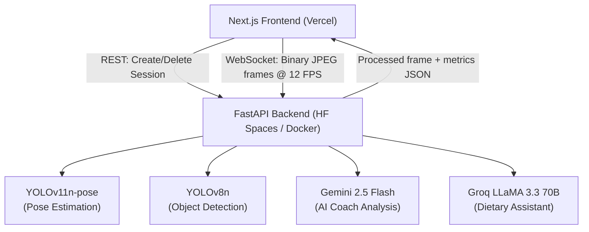

# FitVision AI — Project Summary

## Overview

**FitVision AI** is a full-stack, real-time exercise analysis platform that uses computer vision and AI to evaluate athletic performance, count reps, measure jump heights/distances, assess form, and provide personalized sports recommendations and nutritional advice. It was designed to mimic the assessment tools used by Sports Authority of India (SAI) certified coaches.

The project is deployed on **Hugging Face Spaces** (Docker SDK) and the frontend is deployed on **Vercel**.

---

## Architecture

---

## Technical Stack

### Backend
| Layer | Technology |
|---|---|
| Web Framework | **FastAPI** + **Uvicorn** (ASGI) |
| Real-time Communication | **WebSockets** (native FastAPI) |
| Computer Vision | **OpenCV** (headless), **NumPy**, **SciPy** |
| Pose Estimation | **Ultralytics YOLO11n-pose** (17-keypoint COCO skeleton) |
| Object Detection | **YOLOv8n** |
| AI Coach | **LangChain** + **Google Gemini 2.5 Flash** |
| Dietary AI | **LangChain** + **Groq LLaMA 3.3-70b-versatile** |
| Data Validation | **Pydantic v2** |
| Config | **python-dotenv** |
| Containerization | **Docker** (Python 3.11-slim) |
| Deployment | **Hugging Face Spaces** (port 7860) / **Railway** |

### Frontend
| Layer | Technology |
|---|---|
| Framework | **Next.js 16** (App Router) |
| Runtime | **React 19** |
| Camera API | `navigator.mediaDevices.getUserMedia` |
| Streaming | Native **WebSocket API** + `requestAnimationFrame` |
| Styling | **CSS Modules** (Vanilla CSS) |
| Deployment | **Vercel** |

---

## Key Files

| File | Role |
|---|---|
| [fast.py](file:///c:/Users/avijn_th5xjtu/Desktop/code/fitvision/fitvision-api/fast.py) | Main FastAPI app — all REST endpoints, WebSocket endpoints, session management, and per-exercise processing logic |
| [utils.py](file:///c:/Users/avijn_th5xjtu/Desktop/code/fitvision/fitvision-api/utils.py) | `PoseCalibrator` class — YOLO inference, skeleton rendering, angle calculation, moving average filtering |
| [metrics.py](file:///c:/Users/avijn_th5xjtu/Desktop/code/fitvision/fitvision-api/metrics.py) | `PerformanceMetrics` class (~2600 lines) — per-exercise data tracking, final report generation |
| [ai.py](file:///c:/Users/avijn_th5xjtu/Desktop/code/fitvision/fitvision-api/ai.py) | Gemini-powered AI coach — reads saved metrics and produces a full athletic profile report |
| [dietary_assistant.py](file:///c:/Users/avijn_th5xjtu/Desktop/code/fitvision/fitvision-api/dietary_assistant.py) | Groq-powered dietary chatbot with multi-turn conversation history and user profiling |
| [frontend/hooks/useExerciseSocket.js](file:///c:/Users/avijn_th5xjtu/Desktop/code/fitvision/fitvision-api/frontend/hooks/useExerciseSocket.js) | Custom React hook — manages WebSocket lifecycle, camera capture, frame encoding, flow control, and live metrics state |
| [frontend/lib/api.js](file:///c:/Users/avijn_th5xjtu/Desktop/code/fitvision/fitvision-api/frontend/lib/api.js) | Typed REST client for session management |
| [Dockerfile](file:///c:/Users/avijn_th5xjtu/Desktop/code/fitvision/fitvision-api/Dockerfile) | Python 3.11-slim with OpenCV system deps; non-root user for HF Spaces |

---

## Core Implementation: The Streaming Pipeline

The central design is a **request-gated WebSocket streaming loop**:

1. **Client** creates a session via `POST /session/create?exercise=squat&height_cm=170` → receives `session_id`
2. **Client** opens `WebSocket /ws/{session_id}`
3. **Client** captures camera at **320×240 @ 12 FPS**, draws to an off-screen canvas, converts to JPEG blob at **35% quality** (~15–20 KB/frame), and sends as **binary over WebSocket**
4. A **flow-control flag** (`pendingFrameRef`) prevents the client from sending a new frame before the server has responded to the previous one — avoiding queue buildup
5. **Server** decodes the binary JPEG → `cv2.imdecode` → `numpy` array
6. **YOLO11n-pose** runs inference, extracts 17 keypoints with confidence scores
7. The session's **exercise processor** computes joint angles, rep counts, form feedback
8. A **calibration phase** (first 30 frames) measures pixel-to-cm ratio using the detected person height vs. the user's declared height
9. The processed frame is **re-encoded at 320×240, JPEG 40%** and sent back as base64 inside the JSON response

---

## Supported Exercises

| Exercise | Metric Tracked | Form Checks |
|---|---|---|
| **Push-ups** | Elbow angle (rep counter) | Hip sag detection |
| **Squats** | Knee angle (rep counter + depth) | Depth quality, concentric/eccentric timing |
| **Sit-ups** | Torso inclination (rep counter) | ROM completeness, eccentric control |
| **Sit-and-Reach** | Wrist-to-ankle reach distance (cm) | Knee extension validity, bilateral symmetry |
| **Skipping** | Jump count, airtime detection | Double-bounce detection |
| **Jumping Jacks** | Open/closed state machine (rep counter) | — |
| **Vertical Jump** | Jump height in cm (with calibration) | Landing knee angle assessment |
| **Broad Jump** | Horizontal distance in cm (with calibration) | Countermovement depth |

---

## AI Features

### 1. AI Coach (`/analyze` — Gemini 2.5 Flash)
After a session, the collected metrics are passed to Gemini with a structured prompt that produces:
- **Body Condition Assessment** (flexibility, explosive power, endurance, core stability, cardiovascular fitness, coordination)
- **Athletic Profile Type** (power / endurance / agility / mixed)
- **Top 5 Recommended Sports** with rationale matched to the athlete's test scores
- **3 Key Development Areas** with drills
- **Overall Fitness Score: X/100**

### 2. Dietary Assistant (`/api/diet/*` — Groq LLaMA 3.3-70b)
A multi-turn conversational nutritionist that:
- Maintains **10-message sliding context window**
- Accepts a **UserProfile** (age, weight, height, activity level, dietary preference, allergies, goals)
- Accepts **ExerciseHistory** (total tests, recent exercises, average performance score, streak)
- Provides personalized, science-backed dietary advice with awareness of **Indian dietary preferences**
- Singleton pattern — shared assistant instance across requests

---

## Metrics Engine (metrics.py)

The `PerformanceMetrics` class is the computational heart of the system. It tracks **per-exercise, per-rep** data:

- **Angular data**: joint angles at every frame, stored in rolling `deque` buffers
- **Temporal data**: eccentric/concentric phase durations, sticking points
- **Spatial data**: jump heights, reach distances, broad jump distances — all converted from pixels to centimeters using the calibrated `cm_per_pixel` ratio
- **Quality flags**: good reps vs bad reps, form violation counts
- **Final report methods**: `pushup_metrics()`, `squat_metrics()`, `situp_metrics()`, etc. — each compiles a structured JSON summary saved to `results/metrics_{session_id}.json`

---

## API Surface (REST + WebSocket)

| Endpoint | Method | Description |
|---|---|---|
| `/` | GET | API info |
| `/health` | GET | Health check with active session count |
| `/exercises` | GET | List all 8 supported exercises |
| `/session/create` | POST | Create session (exercise + height) |
| `/session/{id}` | GET | Session info |
| `/session/{id}/metrics` | GET | Final metrics JSON |
| `/session/{id}` | DELETE | End session + return final metrics |
| `/ws/{session_id}` | WS | **Primary streaming endpoint** (client sends frames) |
| `/ws/webcam/{session_id}` | WS | Server-side webcam endpoint (for local testing) |
| `/analyze` | POST | Trigger Gemini AI coach analysis |
| `/api/diet/chat` | POST | Chat with dietary assistant |
| `/api/diet/profile` | GET/POST | User dietary profile |
| `/api/diet/history` | POST | Sync exercise history to diet assistant |
| `/api/diet/onboarding` | GET | Onboarding questions |
| `/api/diet/clear` | DELETE | Clear conversation history |
| `/test` | GET | Built-in HTML test page |

---

## Deployment

| Environment | Platform | Config |
|---|---|---|
| Backend | **Hugging Face Spaces** | Docker SDK, port 7860 (`Dockerfile`) |
| Backend alt. | **Railway** | `railway.toml`, `Procfile` |
| Frontend | **Vercel** | `vercel.json` with API URL proxy config |

> [!NOTE]
> The Dockerfile creates a **non-root user** (`uid=1000`) as required by HF Spaces sandbox policy. System packages (`libgl1`, `libglib2.0-0`, `ffmpeg`) are installed to support OpenCV headless rendering.
